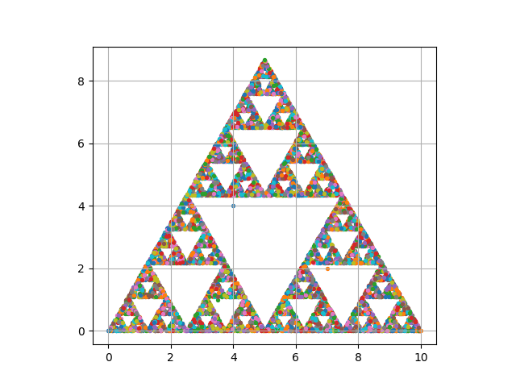

El juego del caos consiste simplemente en ir dibujando puntos de forma aleatoria, de tal
forma que dicha sucesión de puntos en el límite nos va a dar una fractal conocido.
Consideremos un triángulo con vértices A,B,C (Comúnmente es utilizado en triángulo
equilátero) y ejecutemos el siguiente algoritmo:
1. Elige un punto $X_0$ en el plano.
2. Elige aleatoriamente uno de vértices A,B,C.
3. El punto siguiente $X_i+1$ será el punto medio entre el punto $X_i$ y el vértice elegido.
4. Y se vuelve al paso 2 una cantidad n de veces 

En el archivo *trian_sierp* se crea un algoritmo para crear el triangulo de sierpinski haciendo *10,000 iteraciones*
