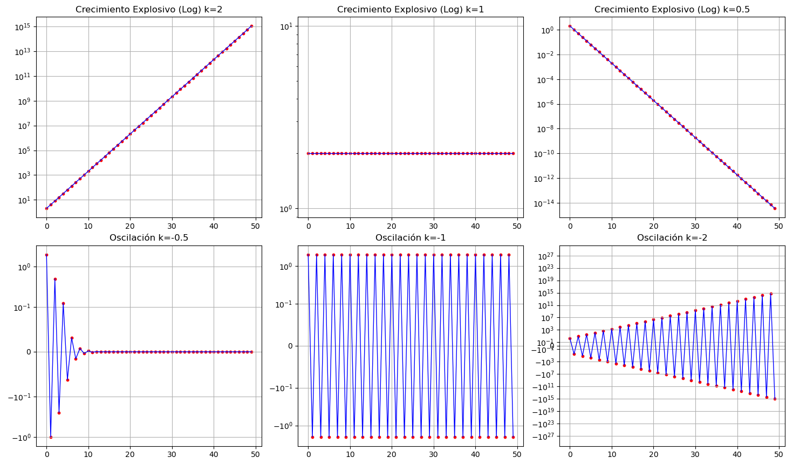
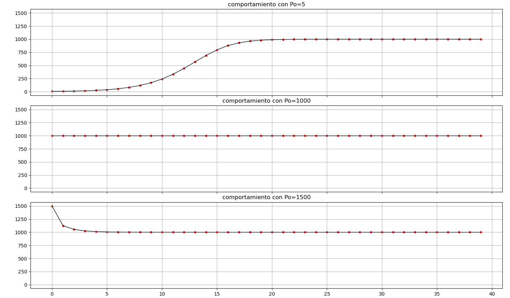
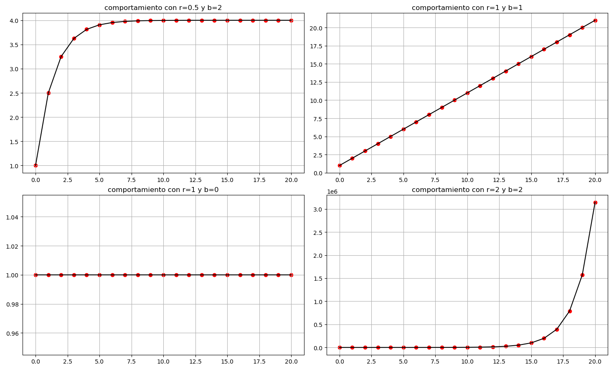
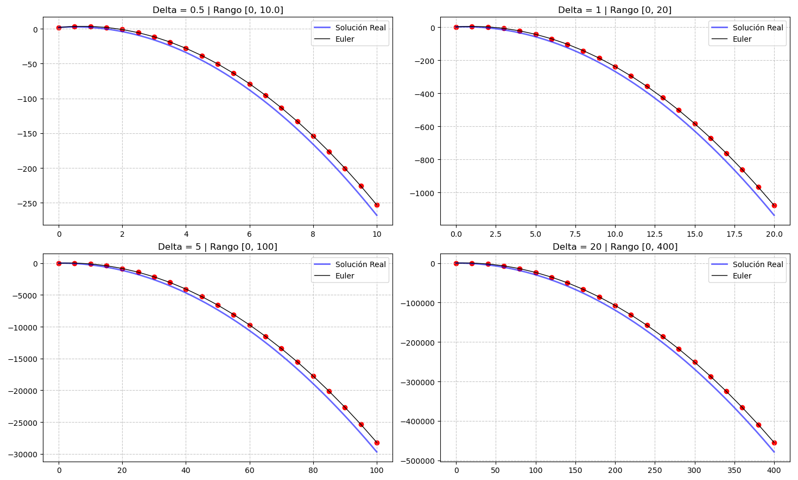

# Modelos de Ecuaciones en Diferencias Finitas 
Esta practica es un primer acercamiento hacia la discretizacion de funciones continuas, con las cuales podemos trabajar de una forma mas simple (de forma computacional). 
Podemos transformar una ecuación diferencial $\frac{dy}{dt} = f(t, y)$ a una ecuación en diferencias de la forma:
$$\frac{\Delta y}{\Delta t} = \frac{y_{n+1} - y_n}{t_{n+1} - t_n} = f(t, y)$$

Despejando obtenemos $\Delta y = f(t, y) \cdot \Delta t$, es decir, $y_{n+1} - y_n = f(t, y) \cdot \Delta t$.

Finalmente, llegamos a la **ecuación recursiva** que nos permite realizar el cálculo computacional:
$$y_{n+1} = y_n + f(t, y) \cdot \Delta t$$

Nos apoyamos un poco en el codigo ya creado de *solucion mediante el metodo de Euler*, probamos los sistemas con distintos valores y vemos como se comporta. 

## Crecimiento exponencial 
Consideremos la siguiente Ecuación en Diferencias Finitas
$$ P_{n+1} = k P_n $$  
y veremos como se comporta consideranto distintos valores de $k$

| k |
| :---: |
| 2 |
| 1 |
| 0.5 |
| -0.5 |
| -1 |
| -2 |

*  K>0
Podemos notar que cuando $K=2$ (o cualquier numero mayor) tenemos que la funcion empieza a crecer de una forma exponencial (crece con una proporcion $k$). Cuando $K=1$ el sistema siempre tiene el mismo valor, con $K=0.5$ tenemos un sistema que monotono pero en este caso empieza a decaer, acercandose de manera exponencial al $0$ 

* K<0
Cuando $K$ es negativa tenemos un sistema que tiende a oscilar, con $K=-2$ tenemos un caso en el que el sistema empieza a oscilar de forma inestable y crece de forma exponencial 

## Modelo logistico 
El modelo logistico es una ecuacion diferencial que se ocupa para modelar poblaciones. La ecuacion que modela esto es:
$$\frac{dP}{dt} = rP(1-P/K)$$
En este caso, consideramos los valores $r=0.5, k=1000$ y las poblaciones iniciales: 
| Po |
| :---: |
| 5 |
| 1000 |
| 1500 |

En este modelo estamos considerando una capacidad de carga de $1000$ y podemos observar que el sistema converge a ese punto sin importar cuales sean nuestras condiciones inciales. El modelo logistico llega a su punto de equilibrio tarde o temprano 

## Dinamicas de poblacion variando los parametros 
| Parámetro $r$ | Parámetro $b$ | 
| :---: | :---: 
| 0.5 | 2 | 
| 1 | 1 |
| 1 | 0 | 
| 2 | 2 | 
Aqui nos ponemos a jugar un poco con los parametros y ver como se comporta el modelo, viendo desde casos en los que explota y otros en los que se mantiene en equilibrio 

## Comparando una ecuacion diferencial con el metodo de Euler 
En este caso vemos la comparacion entre la solucion "analitica" de la ecuacion diferencial 
$$\frac{dy}{dx} = -6x + 3, y(0)=2$$
Con el metodo de Euler (discretizando).
Consideramos los siguientes valores para $\Delta$
| $\Delta$ |
| :---: |
| 0.5 |
| 1 |
| 5 |
| 20 |

 Al aumentar el tamaño del paso $\Delta$, el error acumulado crece de forma considerable. Mientras que con $\Delta = 0.5$ la aproximación es casi idéntica a la real, en $\Delta = 20$ la solución de Euler se separa significativamente de la trayectoria analitica, evidenciando el compromiso entre velocidad de cómputo y precisión numérica. Aunque esta ecuacion es una que se porta "no tan feo" pues es un pequeño polimio, pero el error del metodo de Euler se podria evidenciar más si condideramos otras ecuaciones diferenciales

