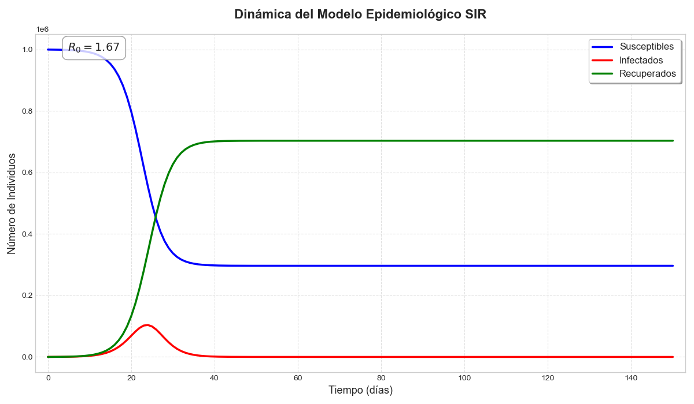
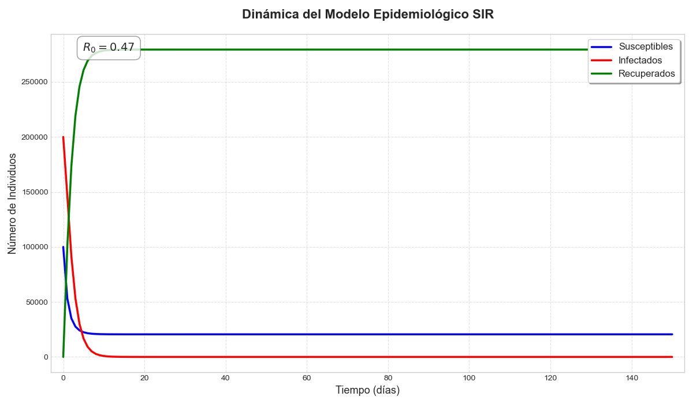
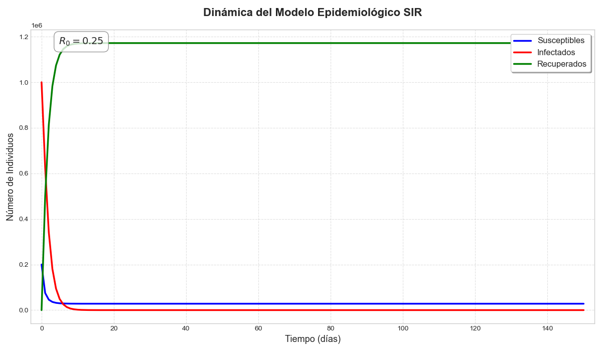
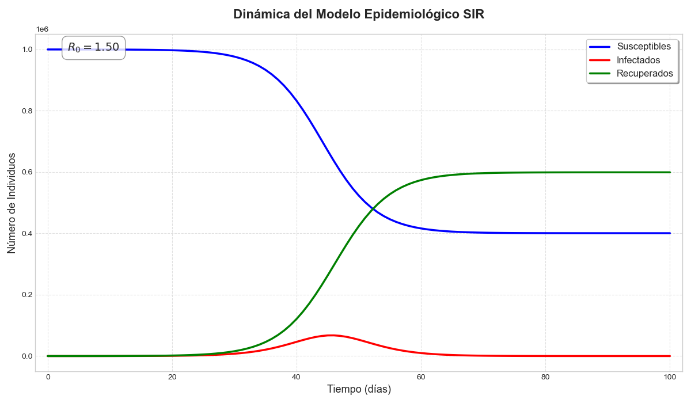

# MODELO SIR

## Introducción
El modelo SIR es un modelo epidemiológico capaz de capturar las dinámicas de diversos brotes infecciosos. Su objetivo es rastrear cómo evoluciona una enfermedad en una población cerrada dividiéndola en tres compartimentos en cada tiempo $n$:

* **Susceptibles ($S_n$):** Personas sanas que pueden contraer la enfermedad.
* **Infectados ($I_n$):** Personas enfermas que pueden transmitir el patógeno.
* **Removidos ($R_n$):** Personas que se han recuperado o han fallecido y ya no contagian.

La población se considera de tamaño fijo $N$, por lo que se debe cumplir que:
$$S_n + I_n + R_n = N$$

### Observaciones del Modelo:
* **Población Cerrada:** No se toman en cuenta nacimientos, muertes externas, inmigraciones ni emigraciones.
* **Mezcla Homogénea:** Se asume que todos los individuos tienen la misma probabilidad de interactuar entre sí.
* **Incidencia Estándar:** El proceso de transmisión se rige por la proporción de infectados. Se asume que una persona tiene un número fijo de contactos sociales por día; por tanto, la probabilidad de que un contacto sea con un infectado es $I/N$.
* **Inmunidad Permanente:** Los individuos susceptibles que se enferman pasan a ser infectados y luego removidos, sin posibilidad de volver a ser susceptibles.

---

### Parámetros del Modelo
Para construir las ecuaciones, definimos dos parámetros fundamentales:

1. **$\alpha$ (Tasa de contacto efectivo):** Indica a cuántas personas contagia un infectado, en promedio, por unidad de tiempo.
   * *Ejemplo:* Si $\alpha = 0.5$, un infectado contagia a media persona por día.
2. **$\beta$ (Tasa de recuperación):** Es el inverso del tiempo que dura la enfermedad ($1/\text{duración}$).
   * *Ejemplo:* Si la enfermedad dura 5 días, cada día se recupera $1/5$ de los infectados ($\beta = 0.2$).

---

### Construcción de las Ecuaciones

#### 1. Susceptibles ($S$)
La cantidad de susceptibles en el tiempo $n+1$ depende de los que había en el tiempo $n$ menos los nuevos enfermos. Los nuevos enfermos se calculan multiplicando la tasa de contacto ($\alpha$), el número de infectados actuales ($I_n$) y la probabilidad de encontrar a una persona sana ($S_n/N$).
$$S_{n+1} = S_n - \frac{\alpha S_n I_n}{N}$$

#### 2. Infectados ($I$)
Los infectados en el tiempo $n+1$ son los que ya estaban enfermos, más los nuevos contagiados (que vienen de $S$), menos los que se recuperan en ese lapso de tiempo (calculados mediante la tasa $\beta$).
$$I_{n+1} = I_n + \frac{\alpha S_n I_n}{N} - \beta I_n$$

#### 3. Removidos ($R$)
Los removidos en el tiempo $n+1$ son los que ya estaban en ese grupo más los que se acaban de recuperar del grupo de infectados.
$$R_{n+1} = R_n + \beta I_n$$

---

### Sistema de Ecuaciones Final

El modelo completo en diferencias queda expresado de la siguiente forma:

$$\begin{cases} 
S_{n+1} = S_n - \dfrac{\alpha S_n I_n}{N} \\ 
\\ I_{n+1} = I_n + \dfrac{\alpha S_n I_n}{N} - \beta I_n \\ 
\\ R_{n+1} = R_n + \beta I_n \end{cases}$$

---

### El Número Reproductivo Básico ($R_0$)

El $R_0$ es uno de los valores más importantes en epidemiología. Representa el número promedio de casos nuevos que genera un solo individuo infectado a lo largo de su periodo infeccioso en una población donde todos son susceptibles.

En este modelo, el $R_0$ se define como:

$$R_0 = \frac{\alpha \cdot S_0}{N \cdot \beta}$$

### Interpretación del $R_0$:
* **Si $R_0 > 1$:** La enfermedad se propagará en la población y habrá un brote epidémico (el número de infectados crecerá inicialmente).
* **Si $R_0 < 1$:** La enfermedad no podrá mantenerse y desaparecerá con el tiempo.

### Relación con los parámetros:
Como mencionamos antes, si al inicio casi toda la población es sana ($S_0 \approx N$), la fórmula se simplifica a:
$$R_0 \approx \frac{\alpha}{\beta}$$

Esto nos dice que la epidemia depende de una "pelea" de velocidades:
1. **Numerador ($\alpha$):** Qué tan rápido se transmite el virus.
2. **Denominador ($\beta$):** Qué tan rápido se recupera la gente (qué tan poco tiempo dura siendo contagiosa).

Si la tasa de contacto ($\alpha$) es mayor que la tasa de recuperación ($\beta$), el $R_0$ será mayor a 1 y tendremos una epidemia.

## Analisis de desarrollos de epidemias 

A continuación se presenta el análisis detallado de los cuatro escenarios simulados. Para cada caso, el Número Reproductivo Básico se calculó mediante la fórmula: 
$$R_0 = \frac{\alpha S_0}{N \beta}$$

---

### Detalles de Simulación

#### **Caso 1: Brote con Recuperación Rápida**
| Caso | $S_0$ | $I_0$ | $\alpha$ | $\beta$ | $R_0$ Calculado | Resultado |
| :---: | :--- | :--- | :---: | :---: | :---: | :--- |
| 1 | 1,000,000 | 127 | 1.0 | 0.6 | **1.66** | Epidemia Controlada |

* **Dinámica:** A pesar de tener muchos susceptibles, la alta tasa de recuperación ($\beta=0.6$) frena el crecimiento explosivo.
* **Observación:** La curva de infectados muestra un pico claro pero no agota a toda la población susceptible, lo que indica una epidemia que se extingue dejando una parte de la población sana.

#### **Caso 2: Inmunidad de Rebaño o Agotamiento de Susceptibles**
| Caso | $S_0$ | $I_0$ | $\alpha$ | $\beta$ | $R_0$ Calculado | Resultado |
| :---: | :--- | :--- | :---: | :---: | :---: | :--- |
| 2 | 100,000 | 200,000 | 0.7 | 0.5 | **0.23** | Extinción Inmediata |

* **Dinámica:** Debido a que hay pocos susceptibles en comparación con la gran cantidad de infectados iniciales, la epidemia no puede crecer. 
* **Observación:** El número de infectados cae drásticamente desde el tiempo cero. Es un escenario donde la mayoría de la población ya es "removida" o simplemente no hay suficientes contactos sanos para mantener la cadena de contagio.

#### **Caso 3: Control por Densidad de Población**
| Caso | $S_0$ | $I_0$ | $\alpha$ | $\beta$ | $R_0$ Calculado | Resultado |
| :---: | :--- | :--- | :---: | :---: | :---: | :--- |
| 3 | 200,000 | 100,000 | 0.75 | 0.5 | **0.50** | Descenso Constante |

* **Dinámica:** Aunque el virus es contagioso ($\alpha=0.75$), el $R_0$ es menor a 1 debido a la baja proporción de susceptibles iniciales respecto al total de la población. 
* **Observación:** Similar al caso anterior, la pendiente de los infectados es negativa desde el inicio. La enfermedad desaparece rápidamente sin generar nuevos picos.

#### **Caso 4: El Peligro de un Inicio Lento**
| Caso | $S_0$ | $I_0$ | $\alpha$ | $\beta$ | $R_0$ Calculado | Resultado |
| :---: | :--- | :--- | :---: | :---: | :---: | :--- |
| 4 | 1,000,000 | 10 | 0.75 | 0.5 | **1.50** | Epidemia Masiva |

* **Dinámica:** Aunque comienza con solo 10 infectados, un $R_0 > 1$ garantiza que cada persona infecte a más de una antes de recuperarse. 
* **Observación:** La curva de infectados crece lentamente al principio y luego dispara un pico masivo que reduce significativamente la población susceptible. Este caso demuestra que comenzar con una cantidad mínima de infectados es suficiente para generar una crisis sanitaria si las condiciones de contagio son favorables.

---

## Conclusiones Generales
El análisis comparativo demuestra que **pequeños cambios en los parámetros iniciales alteran drásticamente el resultado final**. La relación entre la velocidad de contagio y la velocidad de recuperación, ponderada por la disponibilidad de población sana, es el factor determinante para predecir la magnitud de una crisis epidemiológica.

