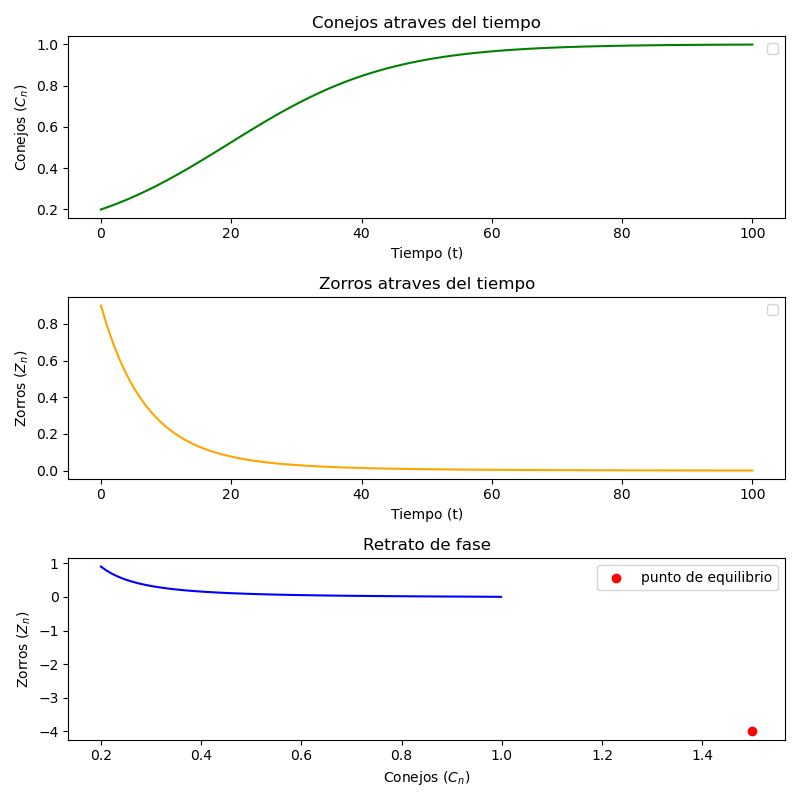
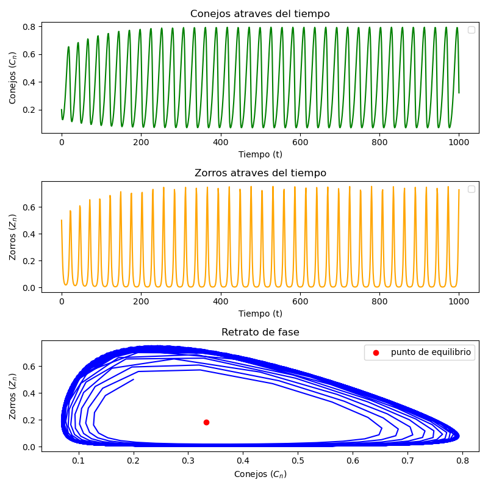
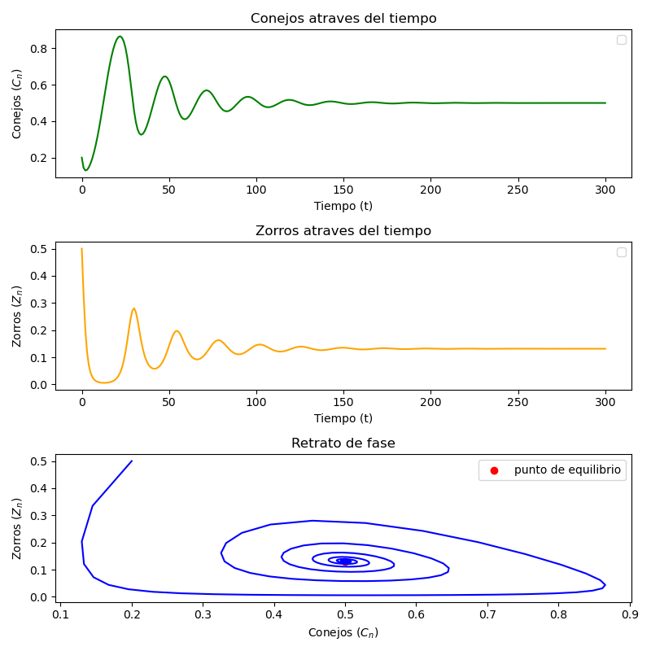

# MODELO DEPREDADOR-PRESA

  

El modelo depredador-presa de Lotka-Volterra es un sistema biológico en el que dos

especies interactúan, una como presa P y otra como depredador D.

Ejemplo, pongamos la población de conejos C (presas) como la variable a controlar, y

dejemos que la propia naturaleza controle su número. Los encargados de controlar esta población serán los zorros Z (depredador).

Supondremos por tanto que la tasa de mortalidad por causa natural es siempre constante.

  

Digamos que:

* $r$ la tasa de crecimiento de los conejos: representa el potencial reproductivo biológico de los conejos.

* $b$ la tasa de exito de caza sobre los conejos: es la eficiencia del depredador para reducir la población de presas

* $d$ es la mortalidad de los zorros: representa la mortalidad natural o la rapidez con la que los zorros mueren si no encuentran alimento

* $c$ Tasa de éxito de caza sobre el depredador: Representa qué tan eficiente es el depredador para convertir la proteína de conejo en "nuevos zorros".

  

Entonces para conocer cuantos conejos tenemos en un tiempo $n+1$ lo podemos hacer relacionando los terminos que tenemos que son los que juegan en este modelo.

---

## Construccion del modelo

Para empezar, la cantidad de conejos en un tiempo $n+1$ está dada por la cantidad de conejos que ya había en el tiempo $n$, más la cantidad de nuevos conejos que hay de un tiempo $n$ al $n+1$. $(C_{n+1} = C_n + rC_n)$.

Como los conejos estan en un espacio que no puede crecer infinitamente, consideramos la ecuacion logistica que nos limita a un espacio que tiene una capacidad "limite". Entonces los conejos siguen la ecuación $(C_{n+1} = C_n + rC_n - rC_n^2)$

Solo nos hace falta que consideremos la cantidad de conejos que los zorros van a cazar. Eso se ve como la interacción entre conejos y zorros multiplicado por la tasa de exito que los segundos tienen.  ($b C_{n} Z_{n}$)

Entonces podemos modelar a los conejos de la forma:

* $C_{n+1} = C_n + rC_n - rC_n^2 - b C_{n} Z_{n}$

  

Ahora veamos con los zorros. Para saber cuantos zorros tenemos en el momento $n+1$, es la cantidad que habia en el momento $n$ menos la cantidad que se muere ($\ d Z_n$) pero a la vez le sumamos la tasa de exito que tienen los zorros (en relacion con como se relacionan los conejos y zorros, es decir, $c Z_n C_n$)

Los zorros quedaria de la forma: $Z_{n+1} = Z_n - d Z_n + c Z_n C_n$

  

Por lo tanto ya tenemos el modelo con el que podemos ver como se relacionarian los conejos con los zorros (factorizando algunos terminos)

$$

\begin{cases}

C_{n+1} = (r + 1)C_n - rC_n^2 - bC_nZ_n \\

Z_{n+1} = cZ_nC_n + (1 - d)Z_n

\end{cases}

$$

---

##  Modelo numerico 
Una vez que ya deducimos un modelo matematico toca pasarlo a un modelo computacional y probarlo con algunos valores, para ver como se comporta el sistema. 
Para esto, usaremos un solucionador de ecuaciones diferenciales mediante el metodo de Euler, este solucionador fue creado por mi y funciona bastante bien (creo). 
Lo primero usar distintos valores, con los que podemos usar ya el solver, el cual ocupa un sistema de ecuaciones (que ya tenemos), tiempo inical y final, y valores iniciales 

#### Parámetros de las Simulaciones

A continuación se presenta el resumen de las condiciones iniciales y tasas de interacción utilizadas para las distintas pruebas del modelo dinámico:

| Simulación | Crecimiento presas ($r$) | Depredación ($b$) | Conversión en zorros ($c$) | Mortalidad zorros ($d$) | Presas iniciales ($C_0$) | Zorros iniciales ($Z_0$) | Pasos de tiempo ($n$) |
| :---: | :---: | :---: | :---: | :---: | :---: | :---: | :---: |
| **v1** | 0.08 | 0.01 | 0.1 | 0.15 | 0.2 | 0.9 | 100 |
| **v2** | 0.25 | 0.91 | 1.8 | 0.60 | 0.2 | 0.5 | 1000 |
| **v3** | 0.25 | 0.95 | 1.1 | 0.55 | 0.2 | 0.5 | 300 |

#### Analisis de simulaciones 

En este caso tenemos un sistema inestable y que colapsa 

Este es un sistema con orbitas estables

Aqui podemos ver otro sistema que oscila en su retrato de fases

---
## Conclusion
Podemos ver que el solucionador que se construyó funciona de buena forma y es consistente. Tenemos un buen modelo que se adapta a distintas necesidades como el que vimos en este caso (un problema de biologia), entonces podriamos usarlo en más ocaciones, simepre y cuando podamos adaptar el problema a el. 